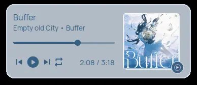
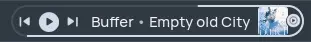

# dominantcolors

Gets the dominant colors from an image and modifies them to generate a palette with a suitable contrast ratio. Receives the image path and prints 3 hexadecimal colors.

It was initially intended for the media player widgets on my [AwesomeWM config](https://github.com/pablonoya/awesomewm-configuration), but it can be used for other purposes.

The first two colors are applied to the popup: one for the background and the other for the UI components. As my theme is dark, the most dominant color is blended with a background color to darken it.



The third color is the accent color for the radial progress bar in top bar.



## Installation

### Using pipx

```shell
pipx install git+https://github.com/pablonoya/dominantcolors.git
```

### Using poetry

```shell
git clone https://github.com/pablonoya/dominantcolors
cd dominantcolors
poetry install
```

## Usage

```shell
$ dominantcolors [OPTIONS] /path/to/image
#d1dbe7
#3b6b92
#d1dbe7
```

```
$ dominantcolors --help
Usage: dominantcolors [OPTIONS] IMAGE_PATH

  Extract dominant colors from IMAGE_PATH

Options:
  -c, --target-contrast FLOAT  Target contrast ratio  [default: 3.0]
  --bg-popup TEXT              Background color of popup  [default: #232A31]
  -a, --alpha INTEGER RANGE    Alpha value for blending with background color
                               [default: 208; 0<=x<=255]
  --bg-topbar TEXT             Background color of topbar  [default: #303942]
  --help                       Show this message and exit.
```
